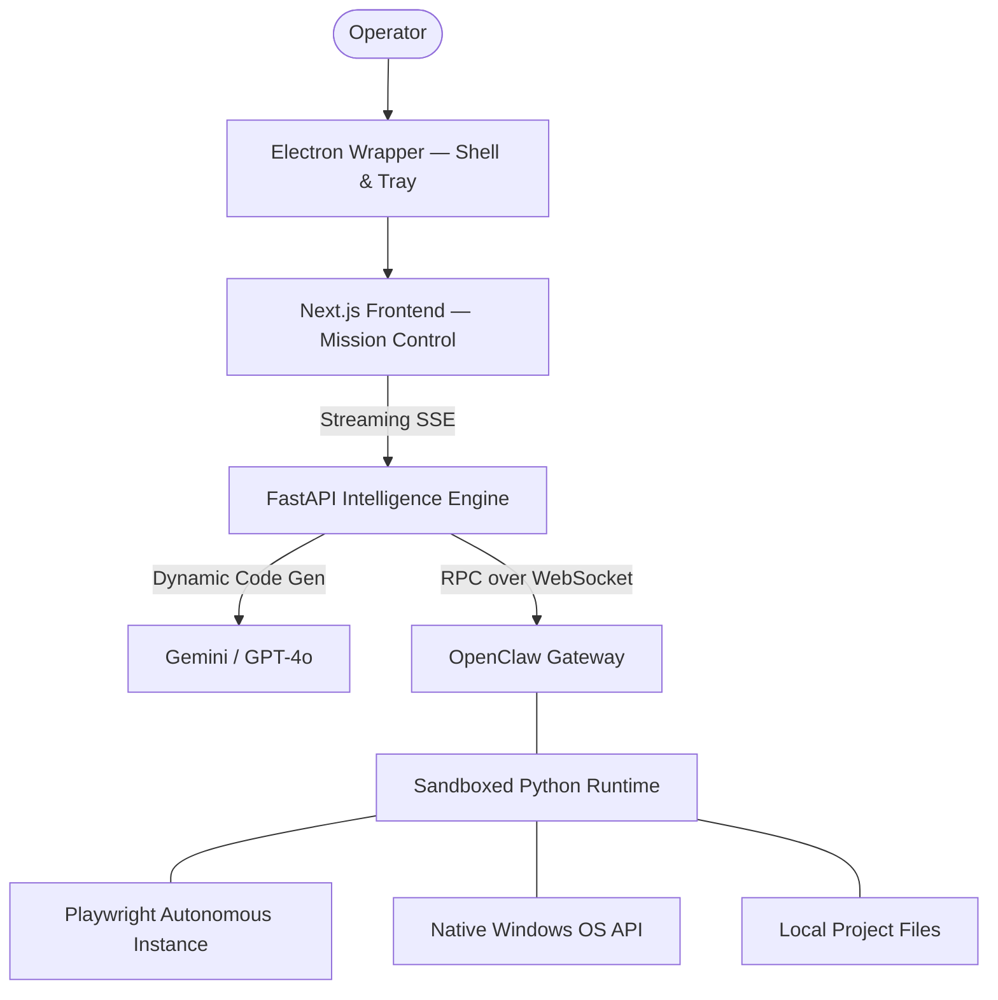

# NEXUS — AUTONOMOUS DESKTOP INTELLIGENCE

<div align="center">

[](https://nextjs.org/)
[](https://fastapi.tiangolo.com/)
[](https://www.electronjs.org/)
[](https://www.python.org/)
[](https://www.typescriptlang.org/)
[](https://openclaw.dev)

**The premier autonomous AI agent for deep desktop and web orchestration.**

[Explore Features](#-capabilities-matrix) • [Quick Start](#-quick-deployment) • [Architecture](#-technical-architecture) • [Security](#-security--privacy)

</div>

---

## 💎 THE NEXUS PHILOSOPHY

NEXUS is not a chatbot. It is a **local-first autonomous operator**. Built for power users and developers, it bridges the gap between high-level LLM reasoning and low-level system execution. NEXUS lives in an Electron shell, manages its own browser sessions, and treats your entire operating system as its workspace.

> *"NEXUS doesn't tell you how to do it. NEXUS just does it."*

---

## 🚀 CAPABILITIES MATRIX

### 🌐 Autonomous Web Intelligence
Powered by `browser-use` + `Playwright`, NEXUS navigates the web with human-like precision.

| Feature | Description |
| :--- | :--- |
| **Vision-Augmented Logic** | DOM-first analysis with intelligent Vision fallback for canvas and complex UIs. |
| **Zero-Login Mirroring** | Instantly mirror your Chrome/Edge sessions via CDP to bypass friction. |
| **Human-in-the-Loop** | Real-time pauses for 2FA, SMS codes, or manual CAPTCHA solving. |
| **Credential Vault** | Secure, persistent storage for automated logins on recurring tasks. |
| **Data Aggregation** | Scrape, process, and structure data from multiple sites into a single report. |

### 📂 Native Productivity Suite
Deep integration with Microsoft Office and standard document formats.

| Category | capabilities |
| :--- | :--- |
| **Excel 📊** | Create workbooks, inject formulas, generate charts, and apply conditional formatting. |
| **Word 📝** | Generate structured reports, manage heading hierarchies, and embed images. |
| **PowerPoint 🎨**| Build entire pitch decks with dynamic layouts and data-driven slides. |
| **PDF 📄** | Merge, split, rotate, extract text, and convert DOCX to PDF seamlessly. |
| **File System 📁** | Recursive search, batch rename, auto-organization, and clickable path shortcuts. |

### 🖥️ OS & Desktop Command
Full control over the Windows environment via the OpenClaw RPC bridge.

| Action | Description |
| :--- | :--- |
| **Process Control** | Launch, monitor, and terminate any desktop application by name. |
| **Input Simulation** | Native keyboard typing and mouse click orchestration at any coordinate. |
| **Terminal Access** | Execute PowerShell or CMD commands directly with real-time feedback. |
| **System Query** | Inspect hardware state, screen resolution, and active network connections. |

---

## 🏗️ TECHNICAL ARCHITECTURE

NEXUS utilizes a decentralized architecture to ensure security and responsiveness.



### The Three Pillars:
1.  **The Shell (Electron)**: Provides the native desktop experience, system tray integration, and managing the lifecycle of background services.
2.  **The Engine (FastAPI)**: The orchestration layer that translates natural language into actionable Python scripts.
3.  **The Bridge (OpenClaw)**: A secure, Ed25519-signed WebSocket gateway that executes code on the host machine.

---

## 🛠️ QUICK DEPLOYMENT

Get NEXUS up and running in minutes.

### 1. Repository Setup
```bash
git clone https://github.com/Rajkumars777/agent02.git
cd agent02
npm install
```

### 2. Environment Preparation
```bash
# Initialize the Python intelligence layer
cd backend
python -m venv venv
venv\Scripts\activate
pip install -r requirements.txt
cd ..
```

### 3. Configuration
Create a `.env` in the `backend/` folder:
```env
GEMINI_API_KEY=your_google_ai_key
# Optional: OPENAI_API_KEY=your_openai_key
```

### 4. Mission Launch
Start the entire stack (Electron, Frontend, Backend, and Gateway) with a single command:
```bash
npm run electron:dev
```

---

## 🛡️ SECURITY & PRIVACY

NEXUS is built with a **Security-First** mindset:
*   **Local Execution**: Your data never leaves your machine unless you explicitly ask for a web search or AI inference.
*   **Signed RPC**: Every command sent to the execution gateway is verified via **Ed25519 cryptographic signatures**.
*   **Vault Protection**: Credentials are stored in your local user profile (`AppData/Local/NEXUS`) and are never synced to any cloud.
*   **Full Transparency**: Every action taken by the agent is streamed live to the **Timeline Feed** with clickable source code for review.

---

## 🤝 CONTRIBUTING

We welcome contributors who want to push the boundaries of autonomous agents.
1. Fork the repo and create your feature branch.
2. Ensure you follow the coding standards in `backend/core/`.
3. Submit a PR with detailed video/screenshot walkthroughs of your changes.

---

<div align="center">
  <p>Dedicated to the next era of Human-AI collaboration.</p>
  <sub>Built with ⚡ and Neural Intelligence.</sub>
</div>
