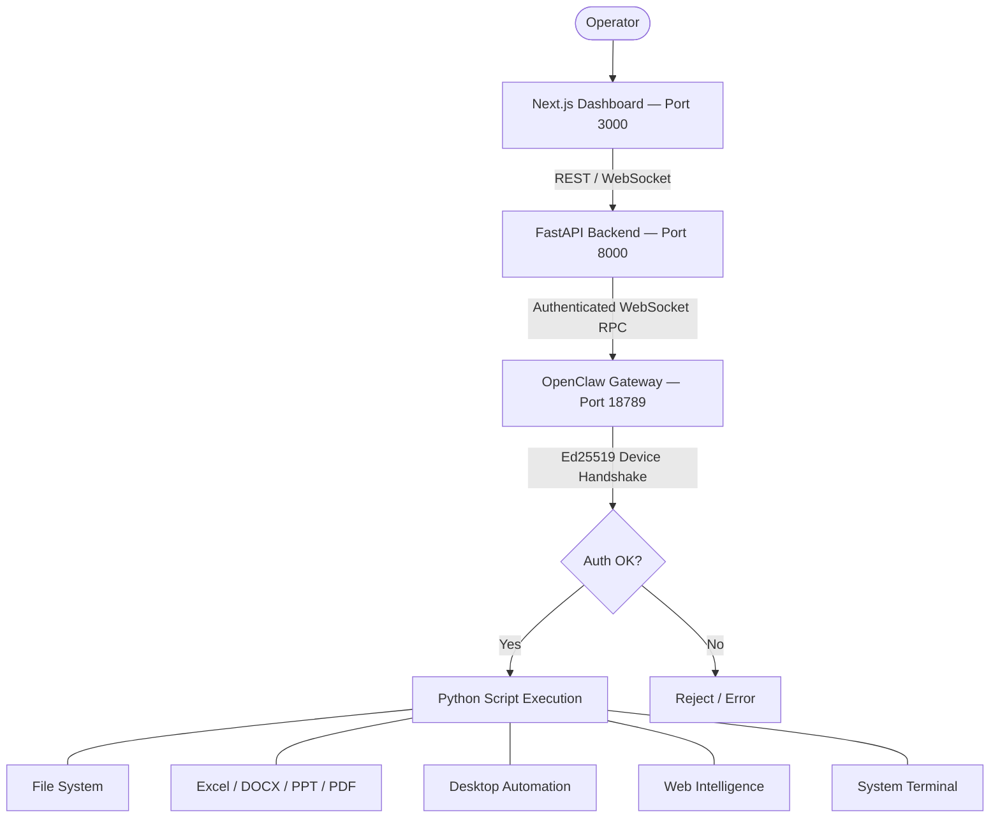

# NEXUS — MISSION CONTROL

[](https://nextjs.org/)
[](https://fastapi.tiangolo.com/)
[](https://www.python.org/)
[](https://www.typescriptlang.org/)
[](https://openclaw.dev)
[](https://www.microsoft.com/windows)


NEXUS is a fully autonomous AI agent that lives on your desktop. It accepts natural language commands and independently writes, executes, and cleans up code to complete real tasks — no manual steps, no copy-paste, no tutorials. It operates a complete stack: a Next.js operator dashboard, a FastAPI intelligence engine, and an OpenClaw Gateway that acts as the secure bridge between the AI and your local operating system.

---

## HOW IT WORKS

When you issue a command, NEXUS does not return instructions. It takes action. The agent generates a Python script on-the-fly, executes it, returns a polished response in the dashboard, and deletes the script. Every task is self-contained and leaves no friction behind.

The system operates in three tiers:

| Tier | Component | Role |
| :--- | :--- | :--- |
| Operator Interface | Next.js Dashboard | Command input, real-time output, history, settings |
| Intelligence Engine | FastAPI + Google Gemini | Natural language processing, code generation |
| Execution Layer | OpenClaw Gateway | Secure WebSocket bridge to local system tools |

---

## CORE CAPABILITIES

### File System Management

NEXUS treats your file system as a fully programmable workspace. Every file path in a response is rendered as a clickable link in the dashboard.

| Operation | Description |
| :--- | :--- |
| Directory Listing | Lists all files and folders with full absolute Windows paths |
| File Search | Locates files by name, extension, or pattern across any directory |
| Copy / Move | Relocates single files or entire directory trees |
| Rename | Batch renames files using patterns, prefixes, or sequences |
| Delete | Removes files or directories with confirmation |
| Organize | Sorts files into subfolders by type, date, or custom rule |
| Read File | Reads and displays content of any text-based file directly in the chat |
| Create File | Generates new files with user-specified content |

> Output rule: File listings always display the complete absolute path (e.g., `C:\Users\rajak\Documents\report.xlsx`). Every path is automatically rendered as a clickable, openable link in the dashboard.

---

### Excel Automation (`.xlsx`, `.xls`, `.csv`)

NEXUS can create, edit, format, and analyze Excel workbooks programmatically using `openpyxl` and `pandas`. No Excel installation is required.

| Operation | Description |
| :--- | :--- |
| Create Workbook | Generates new `.xlsx` files from scratch with headers and data |
| Read Data | Extracts and displays cell data, ranges, and entire sheets |
| Write Data | Populates cells, rows, and columns with user-specified values |
| Formula Injection | Inserts Excel formulas (SUM, AVERAGE, IF, VLOOKUP, etc.) |
| Cell Formatting | Applies bold, colors, borders, number formats, and alignments |
| Chart Generation | Creates bar, line, pie, and scatter charts from data ranges |
| Multi-Sheet Operations | Creates, renames, copies, or deletes sheets within a workbook |
| CSV Import/Export | Converts between `.csv` and `.xlsx` formats |
| Data Summaries | Generates statistical summaries (max, min, mean, count) across columns |
| Conditional Formatting | Highlights cells based on value thresholds or rules |

**Example command:** _"Create an Excel workbook in Downloads with Q1–Q4 sales data, calculate totals per row, and add a bar chart."_

---

### Word Document Automation (`.docx`)

NEXUS generates and edits Word documents programmatically using `python-docx`. Documents are saved directly to your file system.

| Operation | Description |
| :--- | :--- |
| Create Document | Generates a new `.docx` file with defined structure and content |
| Heading Hierarchy | Applies H1–H4 headings with proper document structure |
| Paragraph Insertion | Writes multi-paragraph body text with user-defined content |
| Font Styling | Applies bold, italic, underline, font size, and color |
| Table Creation | Inserts formatted tables with headers, borders, and data |
| Bullet & Number Lists | Creates structured lists with indentation levels |
| Header and Footer | Adds persistent page headers and footers |
| Page Breaks | Inserts manual page breaks at any position |
| Image Insertion | Embeds images into a document at a given section |
| Document Summary | Reads an existing `.docx` and outputs its text content to the dashboard |

**Example command:** _"Write a 3-page project report in DOCX format with an intro, methodology, and conclusion section. Save to Downloads."_

---

### PowerPoint Automation (`.pptx`)

NEXUS builds presentation decks slide-by-slide using `python-pptx`. Layouts, placeholders, and chart data are all handled programmatically.

| Operation | Description |
| :--- | :--- |
| Create Presentation | Generates a new `.pptx` with a specified number of slides |
| Slide Layouts | Applies Title, Title+Content, Two Content, and Blank layouts |
| Text Placeholders | Writes title and body text into the correct slide regions |
| Bullet Points | Adds multi-level bullet text with indentation |
| Shape Insertion | Adds rectangles, circles, arrows, and text boxes |
| Chart Embedding | Inserts bar charts, line charts, and pie charts from data |
| Image Insertion | Places images at precise coordinates and sizes |
| Slide Duplication | Copies and replicates slide structures |
| Background Color | Sets per-slide or global background fill colors |
| Slide Reading | Extracts and displays all text content from an existing presentation |

**Example command:** _"Build a 10-slide product pitch deck in PPTX with titles, bullet points, and a revenue chart on slide 7."_

---

### PDF Management (`.pdf`)

NEXUS handles PDF creation, reading, and manipulation using `PyPDF2`, `fpdf2`, and `reportlab`.

| Operation | Description |
| :--- | :--- |
| Read / Extract Text | Extracts all text from a PDF and displays it in the dashboard |
| Merge PDFs | Combines multiple PDF files into a single document |
| Split PDF | Extracts specific page ranges into separate files |
| Rotate Pages | Rotates individual or all pages by 90, 180, or 270 degrees |
| Delete Pages | Removes specified pages from an existing PDF |
| Create PDF | Generates a new PDF with user-defined text, headings, and paragraphs |
| Page Count | Returns total page count and metadata for a given file |
| DOCX to PDF | Converts Word documents to PDF format |
| Watermarking | Overlays text or image watermarks onto PDF pages |

**Example command:** _"Merge all PDF files in my Downloads folder into one document and name it combined_report.pdf."_

---

### Desktop Automation

NEXUS controls and interacts with the Windows operating system at the process and input level.

| Operation | Description |
| :--- | :--- |
| Launch Application | Opens any installed application by name (Chrome, Notepad, VS Code, etc.) |
| Close Application | Terminates a running application by name |
| List Running Processes | Returns a full list of all active processes on the system |
| Type Text | Simulates keyboard input into the currently focused window |
| Press Key | Sends any key or key combination (Enter, Escape, Ctrl+C, etc.) |
| Mouse Click | Performs a click at any pixel coordinate on the screen |
| Open File or Folder | Opens a file or directory using the system's default program |
| Screen Size Query | Returns the current display resolution |
| Batch Command Execution | Runs any terminal command or script via subprocess |

**Example command:** _"Open Notepad, type 'Meeting notes for March 31', and press Enter."_

---

### Web Intelligence

NEXUS can search the web, extract page content, and summarize information in real time.

| Operation | Description |
| :--- | :--- |
| Web Search | Queries search engines and retrieves structured results |
| Page Content Extraction | Scrapes and summarizes text content from any URL |
| Data Aggregation | Collects data from multiple sources and formats it as a table |

---

## SYSTEM ARCHITECTURE



### Communication Protocol

NEXUS uses a secure WebSocket RPC protocol between the FastAPI engine and the OpenClaw Gateway. Authentication follows a challenge-response handshake using **Ed25519 cryptographic signatures** — the agent signs a nonce with its device private key before any message exchange is permitted.

| Phase | Method | Description |
| :--- | :--- | :--- |
| 1 | `connect.challenge` | Gateway issues a nonce challenge |
| 2 | `connect` (signed) | Agent signs the nonce with its Ed25519 private key |
| 3 | `connect.ready` | Gateway confirms authentication |
| 4 | `chat.send` | Agent sends user command with execution directives |
| 5 | `chat` (delta) | Gateway streams real-time response fragments |
| 6 | `chat` (final) | Full polished response is delivered to the dashboard |

---

## DASHBOARD FEATURES

The NEXUS dashboard (`localhost:3000`) is built with Next.js, Framer Motion, and Tailwind CSS. It is designed as a real-time mission console.

| Feature | Description |
| :--- | :--- |
| Real-Time Timeline | Streams agent reasoning, actions, and results as they happen |
| Clickable File Paths | Every absolute path in a response is rendered as an openable link |
| Command History | Sliding drawer with the last 50 commands; one-click re-run or edit |
| Dark / Light Mode | System-aware theme with persistent user preference |
| Cancel Operation | Instantly aborts any running task mid-execution |
| New Chat | Clears the timeline and starts a fresh session |
| Assistant Mode | Toggles an always-active passive assistant session |
| Settings Panel | Configure AI provider, model, API key, and gateway settings |
| Error Highlighting | Errors are displayed in bold red inline within the timeline |

---

## QUICK START

### 1. Clone the Repository
```bash
git clone https://github.com/Rajkumars777/agent02.git
cd agent02
```

### 2. Run the Deployment Wizard
The wizard handles the entire environment setup automatically.
```bash
python setup.py
```
This will:
- Create a Python virtual environment and install all backend dependencies.
- Run `npm install` for the Next.js frontend.
- Install OpenClaw globally via npm.
- Generate a secure cryptographic gateway token.
- Write all required `.env.local` and `backend/.env` configuration files.

### 3. Launch the Mission Stack
```bash
start.bat
```
Opens three terminal sessions:
- **GATEWAY** — OpenClaw Gateway on port `18789`
- **BACKEND** — FastAPI Intelligence Engine on port `8000`
- **FRONTEND** — Next.js Operator Dashboard on port `3000`

The dashboard opens automatically at **http://localhost:3000**.

---

## CONFIGURATION

### Requirements

| Dependency | Version |
| :--- | :--- |
| Python | 3.9+ |
| Node.js | 18+ |
| npm | 8+ |
| OpenClaw | Managed by `setup.py` |
| AI Provider | OpenAI / Google Gemini / OpenRouter |

### Environment Files

**`.env.local`** (frontend)
```env
OPENCLAW_URL=http://127.0.0.1:18789
OPENCLAW_TOKEN=<your_gateway_token>
```

**`backend/.env`** (intelligence engine)
```env
GEMINI_API_KEY=your-google-gemini-key
# or OPENAI_API_KEY=sk-...
```

**`backend/config.json`** (AI routing)
```json
{
  "ai_provider": "google",
  "ai_model": "gemini-2.5-flash",
  "openclaw_token": "<your_gateway_token>"
}
```

All configuration files are generated automatically by `python setup.py`.

---

## DEVELOPMENT

```bash
# Frontend development server (hot reload)
npm run dev

# Backend intelligence engine
cd backend
venv\Scripts\python main.py

# OpenClaw gateway (standalone)
openclaw gateway run
```

---

## CONTRIBUTING

1. Fork the repository and create a feature branch.
2. Run `python setup.py` to initialize your local environment.
3. Test your changes with `npm run dev` and `python backend/main.py`.
4. Submit a pull request with detailed documentation of your changes.
