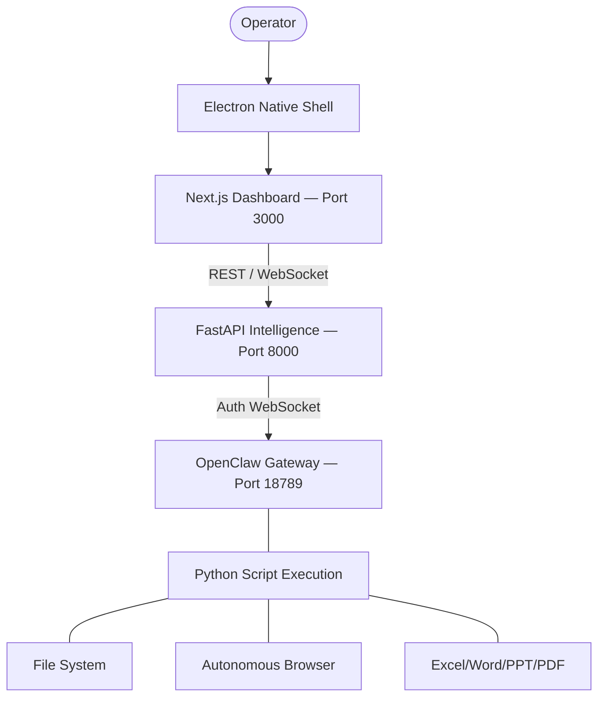

# NEXUS — AUTONOMOUS DESKTOP INTELLIGENCE

[](https://nextjs.org/)
[](https://fastapi.tiangolo.com/)
[](https://www.electronjs.org/)
[](https://www.python.org/)
[](https://www.typescriptlang.org/)
[](https://openclaw.dev)


NEXUS is a premium, fully autonomous AI agent designed for seamless desktop and web automation. It doesn't just provide instructions—it executes tasks directly on your machine. From managing complex file systems and Office documents to navigating live web interfaces and authenticated sessions, NEXUS operates as a native desktop companion via an Electron-powered shell.

---

## 🚀 CORE CAPABILITIES

### 🌐 Autonomous Web Intelligence
NEXUS features a state-of-the-art web automation engine powered by `browser-use` and `Playwright`.
*   **Vision-Augmented Navigation**: Uses a DOM-first approach with intelligent Vision fallback for handling complex layouts and canvas elements.
*   **Zero-Login Mirroring**: Automatically mirrors your existing Chrome/Edge sessions to bypass logins for known sites.
*   **Human-in-the-Loop**: Real-time pauses for 2FA, CAPTCHAs, or credential requests, ensuring seamless security.
*   **Persistent Credential Vault**: Securely remembers your credentials for automated future logins.

### 📂 Native Desktop Mastery
*   **File System Oracle**: Absolute control over your files with clickable links in the dashboard to open directories instantly.
*   **Office Suite Automation**: Programmatically generate, edit, and analyze Excel (`.xlsx`), Word (`.docx`), and PowerPoint (`.pptx`) files.
*   **PDF Manipulation**: Merge, split, rotate, and extract data from PDF documents using Python intelligence.
*   **System Controls**: Launch apps, manage processes, and simulate keyboard/mouse inputs across any application.

---

## 🏗️ SYSTEM ARCHITECTURE

NEXUS operates as a triple-threat stack bundled into a native desktop experience:

| Module | Technology | Role |
| :--- | :--- | :--- |
| **Desktop Shell** | Electron | Native window management, system tray, and service orchestration |
| **Operator UI** | Next.js (Dashboard) | Real-time mission control, timeline feed, and settings |
| **Intelligence** | FastAPI + Gemini/GPT | Agent reasoning, code generation, and secure file handling |
| **Gateway** | OpenClaw | Secure WebSocket bridge for local machine execution |



---

## 🛠️ QUICK START

### 1. Initialize the Core
```bash
git clone https://github.com/Rajkumars777/agent02.git
cd agent02
npm install
```

### 2. Prepare the Intelligence Engine
```bash
cd backend
python -m venv venv
venv\Scripts\activate
pip install -r requirements.txt
cd ..
```

### 3. Configure
Ensure you have a `.env` in the `backend/` directory with your API keys:
```env
GEMINI_API_KEY=your_key_here
```

### 4. Launch NEXUS
Start the full mission stack (Electron, Backend, and Gateway) with a single command:
```bash
npm run electron:dev
```

---

## ⚙️ CONFIGURATION

| Dependency | Required Version |
| :--- | :--- |
| **Node.js** | 18.0.0+ |
| **Python** | 3.10+ |
| **OpenClaw** | `npm install -g openclaw` |

> [!TIP]
> **Pro Tip**: Use the **Persistent Login** feature in the settings panel to allow NEXUS to handle recurring authenticated tasks across different web platforms without interruption.

---

## 🛡️ SECURITY & PRIVACY
NEXUS operates primarily in your local environment. Code execution is sandboxed where possible, and all system interactions are logged in the **Timeline Feed** for full transparency. Credential management uses local encryption within your user directory.

---

## 🤝 CONTRIBUTING
1. Fork the repository.
2. Build and test your features using `npm run electron:dev`.
3. Submit a Pull Request with a clear description of your improvements.

Developed with ⚡ for the next generation of autonomous agents.
